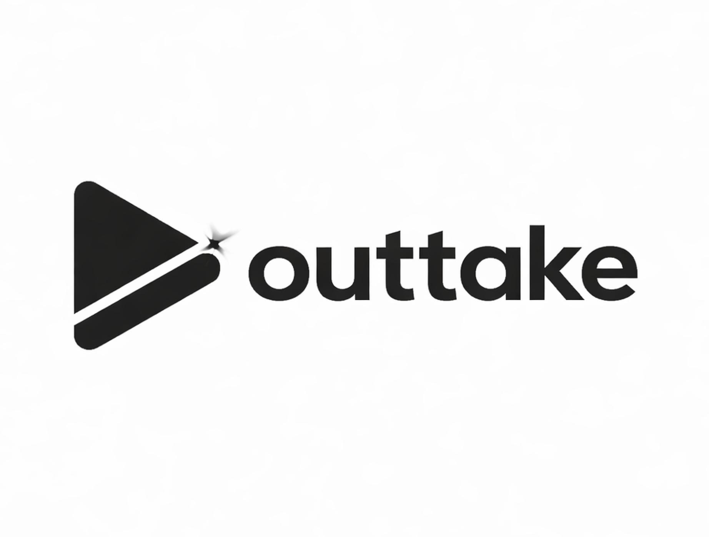

<p align="center">
  
</p>

<p align="center">AI video editing agent with a web UI.</p>

# Upload footage, chat with an AI editor, and get cuts, subtitles, motion graphics, sound effects, and AI-generated clips back.

## Quick Start

```bash
# 1. Install Cursor Agent CLI
curl https://cursor.com/install -fsSL | bash

# 2. Start the FFmpeg MCP server
cd services/ffmpeg_mcp
pip install -r requirements.txt
python server.py          # runs on port 8100

# 3. Start the web app
cd app
cp .env.example .env      # set CURSOR_API_KEY
npm install
npm run dev               # http://localhost:3000

# 4. Install Remotion + transcription deps (root)
npm install               # remotion, @elevenlabs/elevenlabs-js
```

### Environment Variables

| Variable | Where | Purpose |
|----------|-------|---------|
| `CURSOR_API_KEY` | `app/.env` | Cursor Agent CLI authentication |
| `ELEVENLABS_API_KEY` | `.env` | Transcription (Scribe v2) + sound effects |
| `REPLICATE_API_TOKEN` | `skills/video-gen/.env` | AI video generation (Wan 2.6) |

Set `OUTTAKE_AGENT_BACKEND=claude` in `app/.env` to use Claude Code CLI instead of Cursor.

## What It Does

| Capability | Powered by |
|------------|------------|
| Cut, concat, transcode, extract audio | FFmpeg via MCP tools |
| Animated word-by-word subtitles | ElevenLabs Scribe v2 + Remotion |
| Motion graphics (wave transitions, kinetic typography) | Remotion |
| Sound effects from text descriptions | ElevenLabs Text-to-SFX |
| AI video generation (text-to-video, image-to-video) | Replicate Wan 2.6 |
| Audio normalization, complex filters | FFmpeg (Bash) |

## Architecture

```
┌─────────────────────────────────┐
│  Next.js Web App (app/)         │
│                                 │
│  ┌───────────┐  ┌────────────┐  │
│  │ Chat Panel │  │ Video      │  │
│  │ (SSE)     │  │ Preview    │  │
│  └─────┬─────┘  └────────────┘  │
│        │        ┌────────────┐  │
│        │        │ Timeline   │  │
│        │        └────────────┘  │
└────────┼────────────────────────┘
         │
    /api/chat (POST)
         │
    Spawns Cursor Agent CLI
    (or Claude Code CLI)
         │
    ┌────┴────┐
    │ FFmpeg  │  MCP server (port 8100)
    │ MCP     │  probe, cut, concat, transcode,
    └─────────┘  scan_scenes, mix_sfx, ...
```

The web app spawns the agent CLI as a subprocess with `--print --output-format stream-json`. The agent has access to FFmpeg MCP tools, Remotion rendering, ElevenLabs APIs, and Replicate for video generation.

## Project Structure

```
outtake/
├── app/                          Next.js web application
│   └── src/
│       ├── app/
│       │   ├── api/chat/         Agent CLI subprocess + SSE streaming
│       │   └── page.tsx          Main editor layout
│       ├── components/           ChatPanel, Preview, Timeline, MediaBin
│       └── lib/                  useChat hook, cursor-stream-adapter, timecode utils
├── src/                          Remotion compositions
│   ├── OuttakesCaption.tsx       Animated subtitle overlay
│   ├── OuttakeMotion.tsx         Motion graphics (wave, kinetic text, clapperboard)
│   └── Root.tsx                  Composition registry
├── services/ffmpeg_mcp/          FFmpeg MCP server (Python, port 8100)
├── skills/
│   ├── sound-effects/            ElevenLabs SFX generation
│   └── video-gen/                Replicate Wan 2.6 video generation
├── transcribe-pipeline.mjs       ElevenLabs Scribe v2 → aligned.json
├── CLAUDE.md                     Agent system prompt (skills, tools, workflow)
└── SYSTEM_PROMPT.md              Injected into agent at runtime
```

## Tech Stack

- **Frontend**: Next.js 16, React 19, Tailwind CSS, Remotion Player
- **Agent**: Cursor Agent CLI (default) or Claude Code CLI
- **Video Processing**: FFmpeg via MCP (Model Context Protocol)
- **Transcription**: ElevenLabs Scribe v2 (word-level timestamps)
- **Motion Graphics**: Remotion (React-based video rendering)
- **Sound Effects**: ElevenLabs Text-to-SFX API
- **Video Generation**: Replicate Wan 2.6 (text-to-video, image-to-video)

## License

MIT
